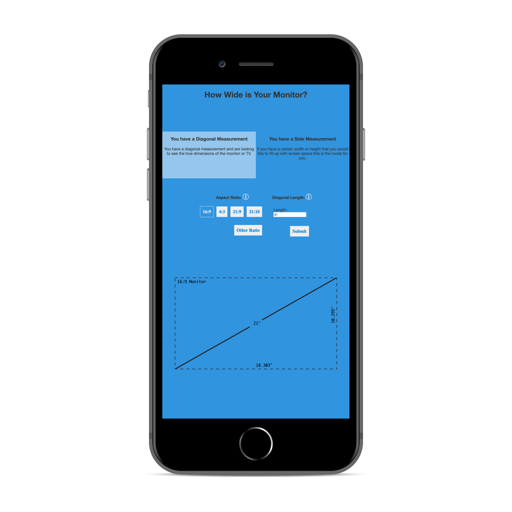

# howWideIsIt
Tells you how wide a monitor is when given the diagonal measurement and aspect ratio.

## How it Looks

## What it is
This website was built with Ractive.js which is a library very simlar to the ever popular Vue.js It uses custom CSS which is why it doesn't look all that great. Oepn an issue and I will be happy to redesign the UI if it does't look good on a device like the iphone x where the words show really small.
