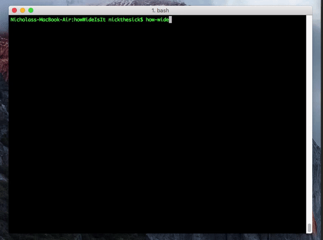

# How-Wide-Is-It
Tells you how wide a monitor is when given the dimensions and aspect ratio. Or what the size of the monitor should be to fill up a certain width or height



## Install:
### For use in your JS
`npm i how-wide-is-it --save`
### For use as CLI 
`npm i how-wide-is-it -g`


## Example:

###How Wide is a 27" monitor that is 16:9?

````JS
var actualSize = require( 'how-wide-is-it' );
console.log( actualSize( 16, 9, 27 ) );

{ 
	height: 13.237053470079092,
	width: 23.53253950236283,
	aspRatio: '16:9',
	diagonal: 27 
}

console.log( actualSize( {
    width: 16,
    height: 9,
    diag: 27
} ) )

{ 
	height: 13.237053470079092,
	width: 23.53253950236283,
	aspRatio: '16:9',
	diagonal: 27 
}

````

### What size monitor would fill up a 23" space that is 16:9?


````JS

var actualSize = require( 'how-wide-is-it' );
console.log( actualSize.diag( 16, 9, 23 ) );

{ 
  height: 12.9375,
  width: 23,
  aspRatio: '16:9',
  diagonal: 26.388992141610863
  }
  
console.log( actualSize.diag( {
  width:16,
  height:9,
  length:23,
  lengthIsOnWideSide:true
} ) );

{ 
  height: 12.9375,
  width: 23,
  aspRatio: '16:9',
  diagonal: 26.388992141610863
  }
````

### Truncation option
If you would like your numbers to be truncated to a certain length simply follow this: `actualSize.truncate=2` This will truncate all values to 2 decimal places.

## CLI Options
````
How Wide Is It Cli Tool

  This Program helps determine the actual dimensions of a tv when given the
  aspect ratio and diagonal inches.

Possible Modes

  default    Use this mode if you have the aspect ratio and the diagonal. Does not need to be specified.
  diagonal   Use this mode if you have the aspect ratio and one side. The side defaults to the width but
             can be reversed by adding the -r flag. Usage: how-wide --diag -w 16 -h 9 -l 23

Options

  --help                Display this usage guide.
  -w, --width number    The width of the aspect ratio. Ex: 16:9 it's the 16, 4:3 it's the 4
  -h, --height number   The height of the aspect ratio. Ex: 16:9 it's the 9, 4:3 it's the 3
  -l, --length number   The length of the diagonal inches across. OR if in diagonal mode the length
                        of the width side.
  -d, --diag            Sets the mode to be in diagonal mode meaning we are searching for the
                        diagonal of the screen.
  -r, --reverse         If in diagonal mode this reverses the length to be on the height side.
````